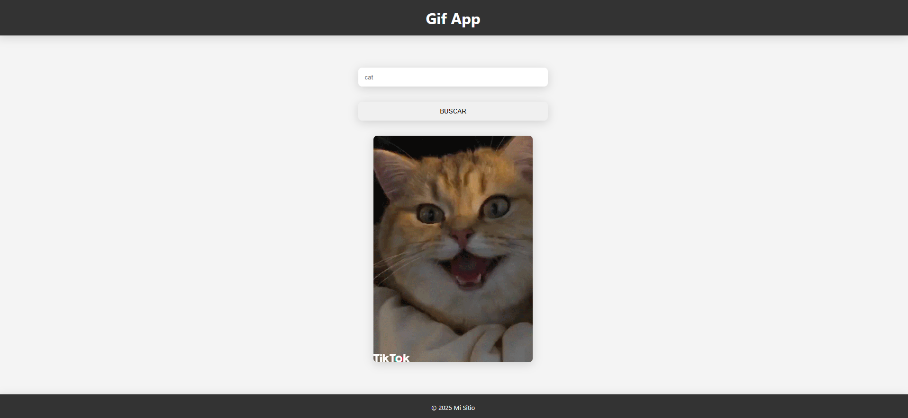
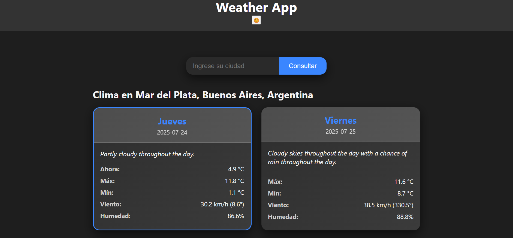
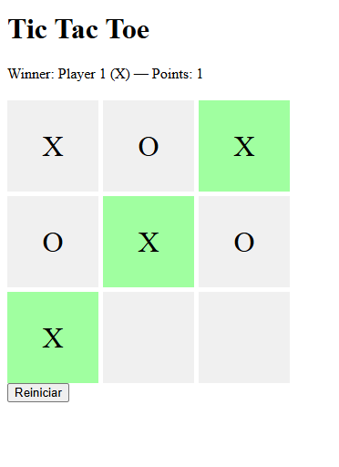
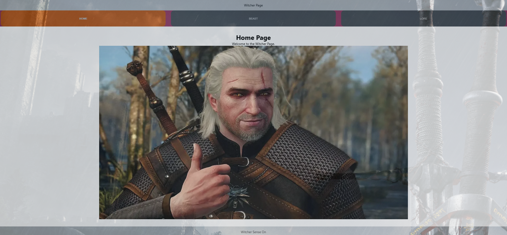
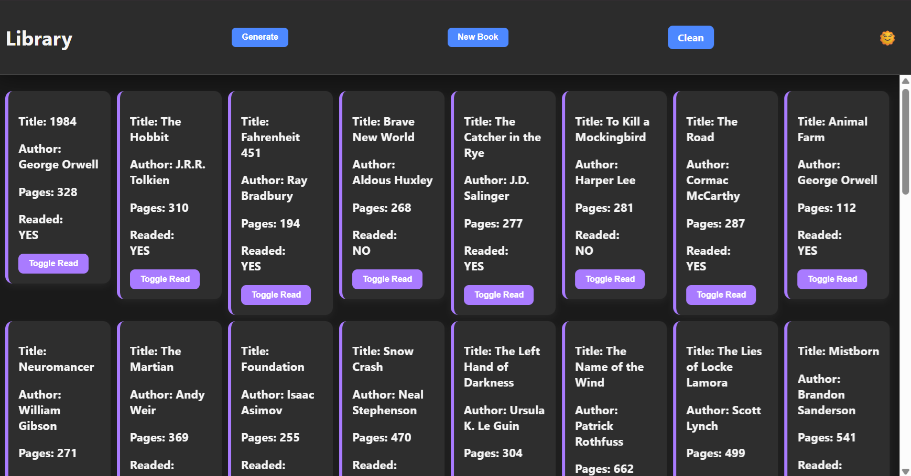

# 🔗 Project Gallery

A simple and responsive showcase of my JavaScript projects. Each card includes a project title, image, and a link to view the live application directly. Built with **vanilla JavaScript**, **HTML5**, and **CSS3**, and bundled using **Webpack** with a modular architecture.

## 🚀 Live Projects

Click on any project image to open the live preview.

| Project        | Live Preview                                          | Screenshot |
|----------------|-------------------------------------------------------|------------|
| Gif Search API | [View](https://romajuanmanuel.github.io/api-gif/)    |  |
| To-Do List     | [View](https://romajuanmanuel.github.io/todolist2/)  |  |
| Weather App    | [View](https://romajuanmanuel.github.io/api-weather/)|  |
| Tic Tac Toe    | [View](https://romajuanmanuel.github.io/tic-tac-toe/)|  |
| Witcher Page   | [View](https://romajuanmanuel.github.io/WitcherPage/)|  |
| Book Library   | [View](https://romajuanmanuel.github.io/book-library/)|  |

## 🛠️ Tech Stack

- **HTML5**
- **CSS3**
- **JavaScript (ES6+)**
- **Webpack (with modular structure)**

## 📁 Features

- Responsive layout
- Dynamic card creation from JS array
- External links open in new tabs
- Clean modular file structure for scalability

## 🔧 Setup & Run Locally

```bash
# Clone the repo
git clone https://github.com/romajuanmanuel/homepage

# Navigate to project directory
cd homepage

# Install dependencies
npm install

# Start development server
npm run start

# Build for production
npm run build
```

## 👨‍💻 Author

Developed by [Juan Manuel Roma](https://github.com/romajuanmanuel)
